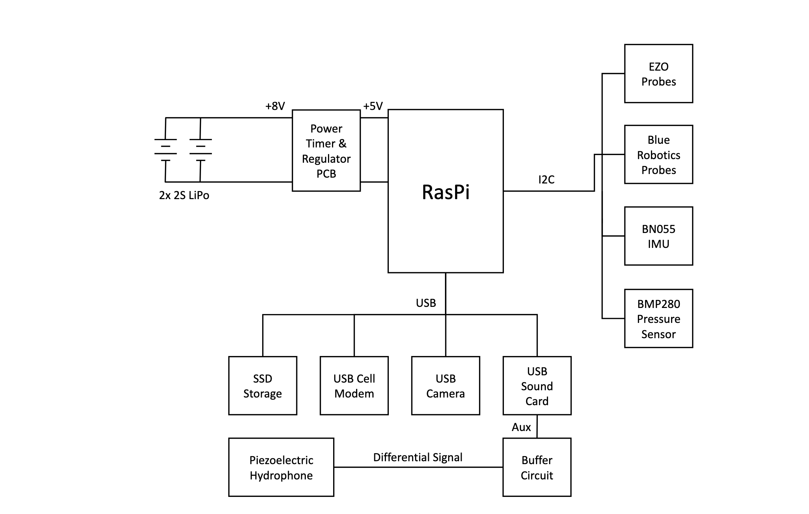

# HackadayBuoy-pi
  

At a high level, the buoy runs [tailscale](https://tailscale.com/) so that you can connect it when it running on its cellular modem connection. It also runs [cockpit](https://cockpit-project.org/) to allow easy management of the deployment and custom linux services.

For parsing GPS NMEA data, it is running [GPSd](https://gpsd.io/) to allow easy subscription to GPS data.

Currently, it also uses python's [http-server](https://docs.python.org/3/library/http.server.html) to allow simple review of the filesystem and captured data on your mobile device while in the field.

A decent workflow for  developing the platform with your prefered IDE is to install [Samba](https://pimylifeup.com/raspberry-pi-samba/) so you can add the Pi's folders as a network drive, and edit directly to it while executing and testing code via SSH.

## Installation

1. Install apt packages `sudo bash installAptPackages.sh`
2. Install python packages `sudo bash installPythonPackages.sh`
3. Install node (v16) `sudo bash installNode16.sh`

For every service the buoy has to run, there is a bash install script that generates the relevant systemd service file information.

For example, within the `/Hydrophone` folder there is a script titled `install_capture_service.sh` which loads and reloads the `capture.sh` as a linux service.

#### Camera

This folder contains the relevant code for setting up the raspberry pi for long-term video capture.

#### Hydrophone

This folder contains the relevant code for setting up the raspberry pi for long-term water audio capture.

#### PowerPCB
This folder contains everything needed to configure your Pi to work with our custom power monitoring PCB.

#### WaterProbe

This folder contains the relevant code for setting up the raspberry pi for long-term water quality capture.  
The directory `asyncSensors` uses pythons asyncio to allow concurrent sensor reading on the I2C bus.

Currently tested & working sensors include:

- Atlas Scientific Dissolved Oxygen Probe
- Atlas Scientific pH Probe
- Blue Robotics Depth Sensor
- Blue Robotics Temperature Sensor
- TSL2591 Light Sensor

Numerical data is stored in a server process which binds the captured data with a local NEDB database via a simple Node / Express app.  

# Quick and dirty code review

  
